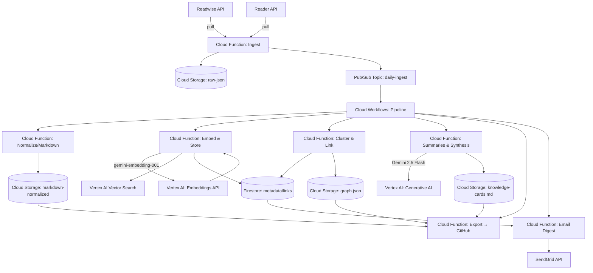
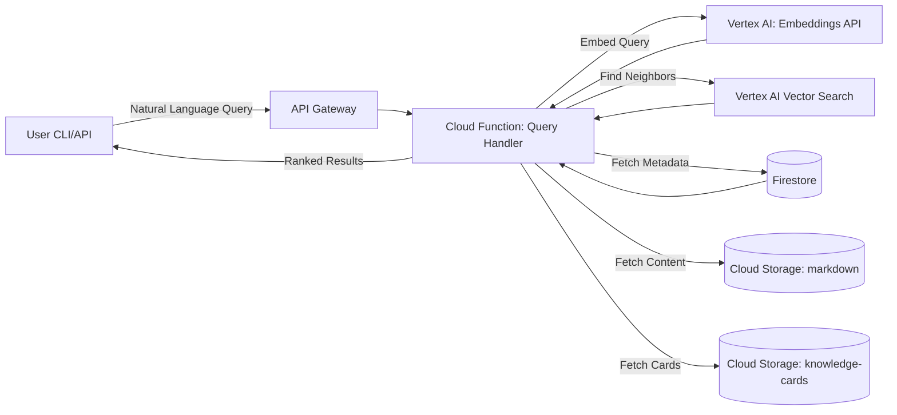

# Architecture – Google Cloud + Vertex AI (MVP)

## Overview

The system uses Google Cloud Serverless components and Vertex AI to create a simple, scalable, and cost-effective solution for processing and querying knowledge data.

---

## System Architecture

### Batch Processing Pipeline (Daily)



### On-Demand Query Flow (User-Initiated)



---

## AI Provider Integration (Vertex AI)

### Architecture

All AI functionality is handled via Vertex AI. No abstraction layer for multiple providers is necessary, which significantly simplifies the architecture.

- **Embeddings**: `gemini-embedding-001` model via Vertex AI API.
- **Generative Models**: `Gemini 2.5 Flash` for summaries and synthesis.
- **Vector Search**: Vertex AI Vector Search for storage and similarity search.

### Secrets Management

```
Google Secret Manager:
├── /kx-hub/gcp/service-account-key
├── /kx-hub/readwise/api-key
└── /kx-hub/github/token
```

---

## Data Flow Details

### Batch Pipeline (Cloud Workflows Orchestration)

1. **Ingest**: Pub/Sub (daily 2am) → Cloud Function Ingest → GCS raw JSON
2. **Normalize**: Cloud Workflow → Cloud Function Normalize → GCS Markdown (+ Frontmatter)
3. **Embed & Store**: Cloud Function → Vertex AI Embeddings API → Vertex AI Vector Search + Firestore metadata
4. **Cluster**: Cloud Function Cluster & Link → Firestore + GCS graph.json
5. **Summarize/Synthesize**: Cloud Function (Gemini 2.5 Flash) → GCS knowledge-cards
6. **Export**: Cloud Function Export → GitHub Commit/PR
7. **Digest**: Cloud Function Email (weekly on Mondays) → SendGrid

### Query Flow (Synchronous API)

1. **User Query**: CLI/API → API Gateway → Cloud Function Query Handler
2. **Query Embedding**: Vertex AI `gemini-embedding-001`
3. **Similarity Search**: Vertex AI Vector Search `FindNeighbors`
4. **Context Enrichment**: Fetch Metadata from Firestore, Content from GCS
5. **Response**: JSON with ranked results + context + highlights
   - Response time target: <1s (P95) thanks to managed Vector Search

---

## Cost Optimization & Scaling

### Strategy

The use of Vertex AI and Google Cloud Serverless components significantly simplifies the cost structure and scaling.

- **No Manual Scaling**: Vertex AI Vector Search and Cloud Functions scale automatically.
- **Pay-per-Use**: Costs are only incurred for actual usage.
- **Simplified MLOps**: No need to manage custom models or indexes.

### Estimated Monthly Costs

| Component | Service | Monthly (estimated) |
|-----------|-------|-----------|
| Embeddings | Vertex AI Embeddings API | $0.10 |
| Vector Search | Vertex AI Vector Search | $3.00 (base index) |
| Generative | Vertex AI (Gemini 2.5 Flash) | $1.50 |
| Functions/Storage | Google Cloud | $0.50 |
| **Total** | | **~$5.10** |

✅ **Goal achieved: ~$5/month. The cost is comparable, but the complexity is drastically reduced.**

---

## Scaling & Upgrade Paths

The architecture is designed to be scalable from the ground up.

- **MVP**: The current architecture is already the scalable solution. Vertex AI Vector Search can handle billions of vectors with low latency.
- **Phase 2**: For extremely high demands, the number of replicas in the Vector Search Index can be increased to further boost throughput.
- **Phase 3**: Not required. The need to migrate to another Vector DB solution is eliminated.

---

## Security & Best Practices

### IAM Least-Privilege
- Each Cloud Function has a dedicated Service Account with minimal permissions.
- GCS: Bucket policies restrict access per Service Account.
- Secret Manager: Strict access control on secrets.

### Monitoring & Alerting
- Cloud Monitoring:
  - Function execution times
  - API Gateway latency
  - Vector Search query latency
  - Cost budgets
- Cloud Logging for all services.

### Deployment
- Terraform for Infrastructure as Code
- CI/CD via GitHub Actions

---