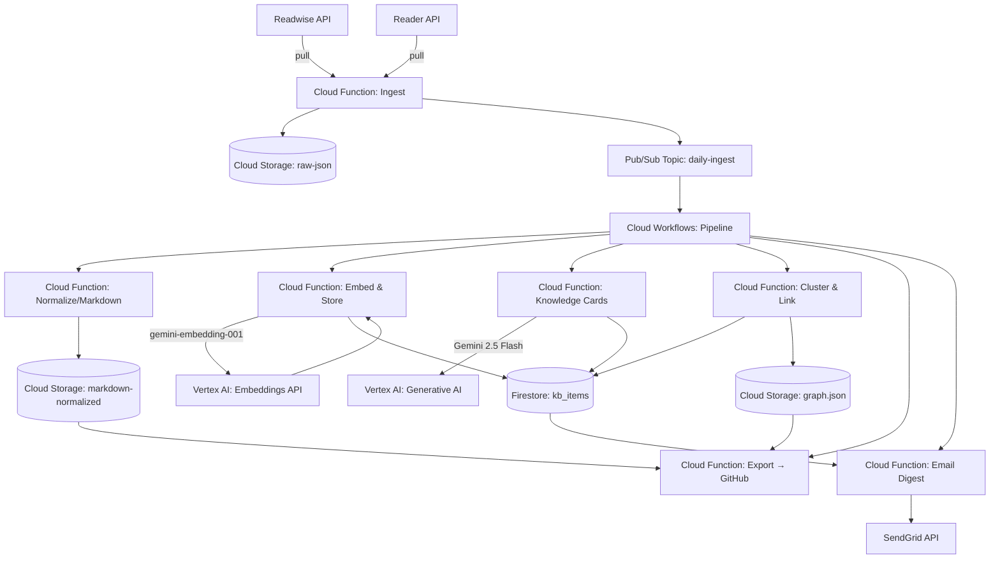
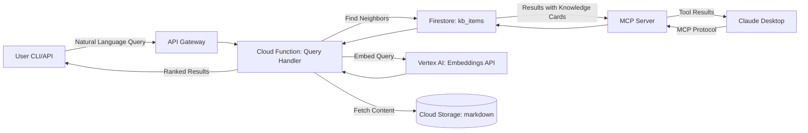
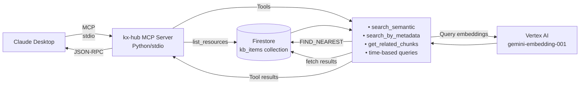

# Architecture – Google Cloud + Vertex AI (MVP)

## Overview

The system uses Google Cloud Serverless components and Vertex AI to create a simple, scalable, and cost-effective solution for processing and querying knowledge data.

---

## System Architecture

### Batch Processing Pipeline (Daily)



### On-Demand Query Flow (User-Initiated)



---

## Claude Desktop Integration (Model Context Protocol / MCP)

### Overview

The kx-hub MCP server enables conversational access to the knowledge base directly from Claude Desktop, eliminating context switching and providing natural language queries to 813+ semantically-searchable chunks via the Model Context Protocol.

**Key Benefits:**
- Zero hosting cost (local Python server)
- <1s query response time (P95)
- Natural language interface without CLI/API overhead
- Seamless integration with Claude for synthesis and exploration

### Architecture



### Query Tools

The MCP server exposes the following tools to Claude:

| Tool | Purpose | Example Input |
|------|---------|---|
| `search_semantic` | Semantic vector search across all chunks | "What did I read about machine learning?" |
| `search_by_metadata` | Filter by author, tag, source, date range | `{author: "Paul Graham", tags: ["startups"]}` |
| `get_related_chunks` | Discover semantically similar chunks | `{chunk_id: "...", limit: 5}` |
| `search_by_date_range` | Time-based filtering | `{start_date: "2025-10-01", end_date: "2025-10-31"}` |
| `get_reading_activity` | Reading statistics for date range | `{period: "last_week"}` |

### Resources

The MCP server exposes chunks as resources with URI format: `kxhub://chunk/{chunk_id}`

Each chunk resource includes:
- Full chunk content
- Metadata (author, source, tags, created_at)
- Embedding vector (768 dimensions)
- Related chunk references

### Deployment

- **Type**: Local Python server (stdio transport)
- **Configuration**: Reads GCP credentials from environment
- **Startup**: Added to Claude Desktop `claude_desktop_config.json`
- **Availability**: Always running on user's machine
- **Cost**: +$0.10-0.20/month for query embeddings only

### Integration with Batch Pipeline

The MCP server uses the same Firestore `kb_items` collection populated by the daily batch pipeline. No separate indexing or synchronization is required—all chunks are immediately available for MCP queries upon storage.

**See Also:** [MCP Integration Architecture](./architecture/mcp-integration.md) for detailed implementation details.

---

## AI Provider Integration (Vertex AI)

### Architecture

All AI functionality is handled via Vertex AI. No abstraction layer for multiple providers is necessary, which significantly simplifies the architecture.

- **Embeddings**: `gemini-embedding-001` model via Vertex AI API.
- **Generative Models**: `Gemini 2.5 Flash` for summaries and synthesis.
- **Vector Search**: Vertex AI Vector Search for storage and similarity search.

### Secrets Management

```
Google Secret Manager:
├── /kx-hub/gcp/service-account-key
├── /kx-hub/readwise/api-key
└── /kx-hub/github/token
```

---

## Data Flow Details

### Batch Pipeline (Cloud Workflows Orchestration)

1. **Ingest**: Pub/Sub (daily 2am) → Cloud Function Ingest → GCS raw JSON
2. **Normalize**: Cloud Workflow → Cloud Function Normalize → GCS Markdown (+ Frontmatter)
3. **Embed & Store**: Cloud Function → Vertex AI Embeddings API → Firestore kb_items (with embeddings)
4. **Knowledge Cards**: Cloud Function (Gemini 2.5 Flash) → Firestore kb_items.knowledge_card field
5. **Cluster & Link**: Cloud Function Cluster & Link → Firestore + GCS graph.json
6. **Export**: Cloud Function Export → GitHub Commit/PR
7. **Digest**: Cloud Function Email (weekly on Mondays) → SendGrid

### Query Flow (Synchronous API)

**Via CLI/API (Cloud Function):**
1. **User Query**: CLI/API → API Gateway → Cloud Function Query Handler
2. **Query Embedding**: Vertex AI `gemini-embedding-001`
3. **Similarity Search**: Firestore Vector Search `FIND_NEAREST`
4. **Context Enrichment**: Fetch Metadata from Firestore, Content from GCS
5. **Response**: JSON with ranked results + context + highlights
   - Response time target: <1s (P95)

**Via Claude Desktop (MCP Server):**
1. **User Query**: Claude Desktop → MCP Server (stdio)
2. **Query Embedding**: Vertex AI `gemini-embedding-001`
3. **Similarity Search**: Firestore native vector search `FIND_NEAREST`
4. **Metadata Fetch**: Direct Firestore queries
5. **Tool Response**: JSON results returned to Claude
   - Response time target: <1s (P95)

---

## Cost Optimization & Scaling

### Strategy

The use of Vertex AI and Google Cloud Serverless components significantly simplifies the cost structure and scaling.

- **No Manual Scaling**: Vertex AI Vector Search and Cloud Functions scale automatically.
- **Pay-per-Use**: Costs are only incurred for actual usage.
- **Simplified MLOps**: No need to manage custom models or indexes.

### Estimated Monthly Costs

| Component | Service | Monthly (estimated) |
|-----------|-------|-----------|
| Embeddings (batch + queries) | Vertex AI Embeddings API | $0.10 |
| Vector Search | Firestore Native Vector Search | $0.30 (queries only) |
| Generative | Vertex AI (Gemini 2.5 Flash) | $1.50 |
| Functions/Storage | Google Cloud | $0.50 |
| MCP Server Queries | Vertex AI Embeddings (local) | +$0.10-0.20 (optional) |
| **Total** | | **~$2.40 - 2.60** |

✅ **Goal achieved: ~$5/month budget. Current estimate ~50% under budget with all features enabled.**

**Note:** MCP server runs locally and only incurs costs for embedding queries. There are no hosting, storage, or compute charges for the MCP server itself.

---

## Scaling & Upgrade Paths

The architecture is designed to be scalable from the ground up.

- **MVP**: The current architecture is already the scalable solution. Vertex AI Vector Search can handle billions of vectors with low latency.
- **Phase 2**: For extremely high demands, the number of replicas in the Vector Search Index can be increased to further boost throughput.
- **Phase 3**: Not required. The need to migrate to another Vector DB solution is eliminated.

---

## Security & Best Practices

### IAM Least-Privilege
- Each Cloud Function has a dedicated Service Account with minimal permissions.
- GCS: Bucket policies restrict access per Service Account.
- Secret Manager: Strict access control on secrets.

### Monitoring & Alerting
- Cloud Monitoring:
  - Function execution times
  - API Gateway latency
  - Vector Search query latency
  - Cost budgets
- Cloud Logging for all services.

### Infrastructure as Code (IaC)

Terraform has been selected as the exclusive tool for provisioning and managing all cloud infrastructure for this project.

- **Tool:** Terraform by HashiCorp
- **Reasoning:** As the industry standard, Terraform provides a mature, declarative, and safe way to manage infrastructure. Its large community, extensive documentation for Google Cloud, and multi-cloud capabilities make it the most pragmatic and lowest-risk choice.
- **Process:** All resources (Cloud Functions, Storage, Firestore, etc.) will be defined in `.tf` configuration files. Changes will be applied via the standard `terraform plan` and `terraform apply` workflow.

### Deployment

- **CI/CD:** Continuous Integration and Continuous Deployment will be managed via GitHub Actions.
- **Workflow:** The GitHub Actions workflow will be configured to automatically run `terraform plan` on pull requests and `terraform apply` on merges to the main branch, ensuring the deployed infrastructure always matches the configuration in the repository.

---