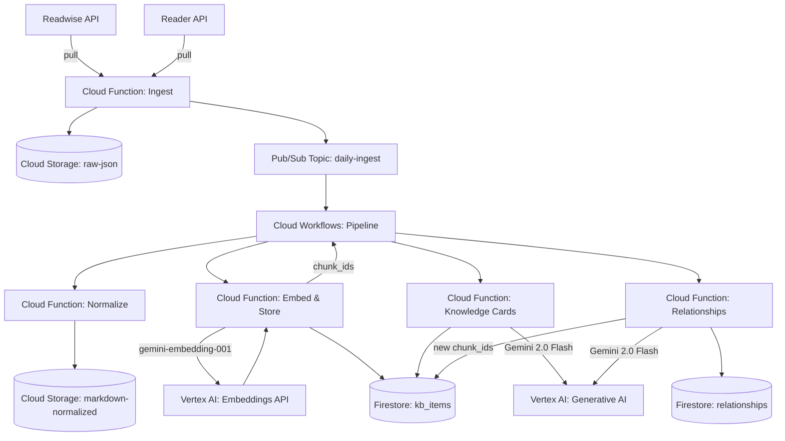
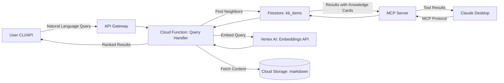
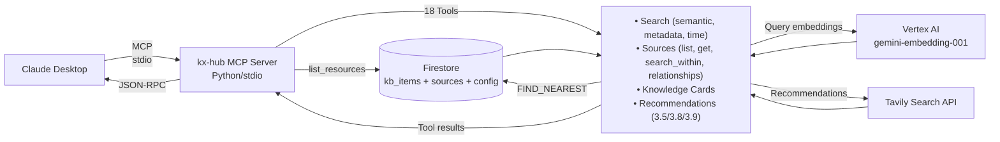
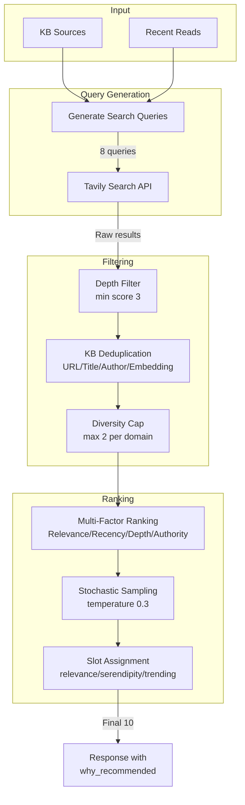

# Architecture – Google Cloud + Vertex AI (MVP)

**Last Updated:** 2026-01-01

## Overview

The system uses Google Cloud Serverless components and Vertex AI to create a simple, scalable, and cost-effective solution for processing and querying knowledge data.

---

## Project Structure

```
src/
├── mcp_server/        # MCP server for Claude Desktop (Cloud Run)
├── ingest/            # Readwise/Reader API ingestion (Cloud Function)
├── normalize/         # JSON → Markdown normalization (Cloud Function)
├── embed/             # Embedding generation + storage (Cloud Function)
├── knowledge_cards/   # AI summaries via Gemini (Cloud Function)
│   ├── main.py        # Cloud Function entry point
│   ├── cli.py         # CLI for manual execution
│   ├── generator.py   # Core generation logic
│   └── schema.py      # KnowledgeCard dataclass
├── relationships/     # Cross-source relationship extraction (Cloud Function)
│   ├── main.py        # Cloud Function entry point
│   ├── cli.py         # CLI for full re-extraction
│   ├── extractor.py   # LLM-based extraction
│   └── schema.py      # Relationship dataclass
└── llm/               # Shared LLM abstraction (kx-llm package)

terraform/
├── *.tf               # Infrastructure definitions
└── workflows/
    └── batch-pipeline.yaml  # Cloud Workflows orchestration
```

---

## System Architecture

### Batch Processing Pipeline (Daily)



### On-Demand Query Flow (User-Initiated)



---

## Claude Desktop Integration (Model Context Protocol / MCP)

### Overview

The kx-hub MCP server enables conversational access to the knowledge base directly from Claude Desktop, eliminating context switching and providing natural language queries to 813+ semantically-searchable chunks via the Model Context Protocol.

**Key Benefits:**
- Zero hosting cost (local Python server)
- <1s query response time (P95)
- Natural language interface without CLI/API overhead
- Seamless integration with Claude for synthesis and exploration

### Architecture



### Query Tools (18 Total)

The MCP server exposes the following tools to Claude:

**Core Search Tools:**
| Tool | Purpose |
|------|---------|
| `search_kb` | Unified semantic search with optional filters |
| `get_chunk` | Get chunk details with related chunks |
| `get_recent` | Get recently added chunks |
| `get_stats` | Knowledge base statistics |

**Source Tools (Story 4.3):**
| Tool | Purpose |
|------|---------|
| `list_sources` | List all sources (books, articles) with metadata |
| `get_source` | Get source details with chunks and relationships |
| `search_within_source` | Semantic search restricted to a source |

**Knowledge Card Tools:**
| Tool | Purpose |
|------|---------|
| `get_knowledge_card` | AI summary for a specific chunk |
| `search_knowledge_cards` | Semantic search across summaries only |

**Reading Recommendations (Stories 3.5, 7.1, 7.2):**
| Tool | Purpose |
|------|---------|
| `recommendations()` | Start async job with config defaults |
| `recommendations(topic="...")` | Start with topic override |
| `recommendations(job_id="...")` | Poll for results |
| `recommendations_history` | List all recommendations from last N days |

**Recommendation Config** (`config/recommendations` in Firestore):
```json
{
  "hot_sites": "tech",
  "tavily_days": 30,
  "limit": 10,
  "topics": ["AI agents", "platform engineering", "developer productivity"]
}
```

**Article Ideas (Story 6.1):**
| Tool | Purpose |
|------|---------|
| `suggest_article_ideas` | Generate blog ideas from KB sources or evaluate specific topic |
| `list_ideas` | List article ideas with optional status filter |
| `accept_idea` | Accept an idea for development |
| `reject_idea` | Reject an idea with optional reason |

**Hot Sites Categories** (domain filtering):
- `tech` - Engineering blogs (25 domains)
- `tech_de` - German tech news (6 domains)
- `ai` - AI/ML sources (17 domains)
- `devops` - Platform engineering (13 domains)
- `business` - Strategy & leadership (13 domains)

### Resources

The MCP server exposes chunks as resources with URI format: `kxhub://chunk/{chunk_id}`

Each chunk resource includes:
- Full chunk content
- Metadata (author, source, tags, created_at)
- Embedding vector (768 dimensions)
- Related chunk references

### Deployment

- **Type**: Local Python server (stdio transport)
- **Configuration**: Reads GCP credentials from environment
- **Startup**: Added to Claude Desktop `claude_desktop_config.json`
- **Availability**: Always running on user's machine
- **Cost**: +$0.10-0.20/month for query embeddings only

### Integration with Batch Pipeline

The MCP server uses the same Firestore `kb_items` collection populated by the daily batch pipeline. No separate indexing or synchronization is required—all chunks are immediately available for MCP queries upon storage.

**See Also:** [MCP Integration Architecture](./architecture/mcp-integration.md) for detailed implementation details.

---

## Reading Recommendations Subsystem (Stories 3.5, 3.8, 3.9, 3.10)

### Overview

AI-powered reading recommendations based on KB content. Analyzes user interests via sources and recent reads, searches external sources via Tavily, and applies multi-factor ranking with deduplication.

### Architecture



### Key Components

| Component | File | Purpose |
|-----------|------|---------|
| Query Generation | `recommendation_queries.py` | Smart queries from sources/reads |
| Quality Filtering | `recommendation_filter.py` | Depth scoring, deduplication |
| KB Deduplication | `recommendation_filter.py` | 4-layer: URL, title, author, embedding |
| Multi-Factor Ranking | `recommendation_filter.py` | Weighted scoring with diversity |
| Tavily Integration | `tavily_client.py` | External search with domain filters |
| Config Storage | `firestore_client.py` | Hot sites, ranking config |

### Configuration (Firestore)

```
config/
├── recommendation_domains   # Quality domain whitelist
├── ranking_config           # Weights and settings
├── hot_sites               # Curated source categories
└── shown_recommendations/   # URL tracking for novelty
```

### Cost Impact

- **Tavily API**: ~$0.50-1.00/month (depends on usage)
- **Vertex AI Embeddings**: +$0.05/month (deduplication checks)

---

## Firestore Data Model

### Collections

| Collection | Purpose | Key Fields |
|------------|---------|------------|
| `kb_items` | Knowledge chunks with embeddings | `source_id`, `embedding`, `knowledge_card` |
| `sources` | Books/articles metadata | `title`, `author`, `chunk_ids` |
| `relationships` | Cross-source semantic connections | `source_id`, `target_id`, `type` |
| `article_ideas` | Blog idea suggestions (Epic 6) | `status`, `suggested_at`, `medium_scores` |
| `async_jobs` | Background job tracking (Epic 7) | `job_type`, `status`, `progress`, `result` |
| `config/*` | System configuration | Various settings |

### Composite Indexes

Managed via Terraform in `terraform/firestore_indexes.tf`:

| Index | Collection | Fields | Purpose |
|-------|------------|--------|---------|
| `article_ideas_status` | `article_ideas` | `status` ASC, `suggested_at` DESC | Filter ideas by status with date ordering |

**Adding new indexes:** Define in `firestore_indexes.tf` and run `terraform apply`.

---

## AI Provider Integration (Vertex AI)

### Architecture

All AI functionality is handled via Vertex AI. No abstraction layer for multiple providers is necessary, which significantly simplifies the architecture.

- **Embeddings**: `gemini-embedding-001` model via Vertex AI API.
- **Generative Models**: `Gemini 2.5 Flash` for summaries and synthesis.
- **Vector Search**: Vertex AI Vector Search for storage and similarity search.

### Secrets Management

```
Google Secret Manager:
├── /kx-hub/gcp/service-account-key
├── /kx-hub/readwise/api-key
└── /kx-hub/github/token
```

---

## Data Flow Details

### Batch Pipeline (Cloud Workflows Orchestration)

The daily pipeline processes new content through 4 sequential steps, orchestrated by Cloud Workflows:

```
┌─────────────┐     ┌─────────────┐     ┌─────────────┐     ┌─────────────┐
│   Ingest    │────>│  Normalize  │────>│    Embed    │────>│  Knowledge  │
│  (trigger)  │     │             │     │   & Store   │     │    Cards    │
└─────────────┘     └─────────────┘     └─────────────┘     └──────┬──────┘
                                                                    │
                                                                    v
                                                            ┌─────────────┐
                                                            │Relationships│
                                                            │ (incremental)│
                                                            └─────────────┘
```

| Step | Cloud Function | Input | Output | AI Model |
|------|---------------|-------|--------|----------|
| 1. **Ingest** | `ingest-function` | Readwise/Reader API | GCS raw JSON + Pub/Sub trigger | - |
| 2. **Normalize** | `normalize-function` | GCS raw JSON | GCS Markdown + Frontmatter | - |
| 3. **Embed & Store** | `embed-function` | GCS Markdown | Firestore kb_items (with embeddings) + sources collection | `gemini-embedding-001` |
| 4. **Knowledge Cards** | `knowledge-cards-function` | Firestore chunks (missing KC) | Firestore kb_items.knowledge_card | `gemini-2.0-flash` |
| 5. **Relationships** | `relationships-function` | New chunk IDs from Step 3 | Firestore relationships collection | `gemini-2.0-flash` |

**Source Management (Step 3):**
- Each chunk is assigned a `source_id` derived from its title
- Sources are automatically created in the `sources` collection if not existing
- Existing sources are updated with new `chunk_ids`
- Enables source-based querying and relationship tracking

**Key Features:**
- **Incremental Processing**: Only new/changed chunks are processed
- **Automatic Triggers**: Ingest publishes to Pub/Sub, Workflow orchestrates remaining steps
- **Error Handling**: Each step has retry logic with exponential backoff
- **Cross-Source Relationships**: Step 5 finds semantic connections between chunks from different sources

**Future Steps (Planned):**
- **Export**: Cloud Function Export → GitHub Commit/PR
- **Digest**: Cloud Function Email (weekly on Mondays) → SendGrid

### Query Flow (Synchronous API)

**Via CLI/API (Cloud Function):**
1. **User Query**: CLI/API → API Gateway → Cloud Function Query Handler
2. **Query Embedding**: Vertex AI `gemini-embedding-001`
3. **Similarity Search**: Firestore Vector Search `FIND_NEAREST`
4. **Context Enrichment**: Fetch Metadata from Firestore, Content from GCS
5. **Response**: JSON with ranked results + context + highlights
   - Response time target: <1s (P95)

**Via Claude Desktop (MCP Server):**
1. **User Query**: Claude Desktop → MCP Server (stdio)
2. **Query Embedding**: Vertex AI `gemini-embedding-001`
3. **Similarity Search**: Firestore native vector search `FIND_NEAREST`
4. **Metadata Fetch**: Direct Firestore queries
5. **Tool Response**: JSON results returned to Claude
   - Response time target: <1s (P95)

---

## Cost Optimization & Scaling

### Strategy

The use of Vertex AI and Google Cloud Serverless components significantly simplifies the cost structure and scaling.

- **No Manual Scaling**: Vertex AI Vector Search and Cloud Functions scale automatically.
- **Pay-per-Use**: Costs are only incurred for actual usage.
- **Simplified MLOps**: No need to manage custom models or indexes.

### Estimated Monthly Costs

| Component | Service | Monthly (estimated) |
|-----------|-------|-----------|
| Embeddings (batch + queries) | Vertex AI Embeddings API | $0.10 |
| Vector Search | Firestore Native Vector Search | $0.30 (queries only) |
| Generative | Vertex AI (Gemini 2.5 Flash) | $1.50 |
| Functions/Storage | Google Cloud | $0.50 |
| MCP Server Queries | Vertex AI Embeddings (local) | +$0.10-0.20 (optional) |
| **Total** | | **~$2.40 - 2.60** |

✅ **Goal achieved: ~$5/month budget. Current estimate ~50% under budget with all features enabled.**

**Note:** MCP server runs locally and only incurs costs for embedding queries. There are no hosting, storage, or compute charges for the MCP server itself.

---

## Scaling & Upgrade Paths

The architecture is designed to be scalable from the ground up.

- **MVP**: The current architecture is already the scalable solution. Vertex AI Vector Search can handle billions of vectors with low latency.
- **Phase 2**: For extremely high demands, the number of replicas in the Vector Search Index can be increased to further boost throughput.
- **Phase 3**: Not required. The need to migrate to another Vector DB solution is eliminated.

---

## Security & Best Practices

### IAM Least-Privilege
- Each Cloud Function has a dedicated Service Account with minimal permissions.
- GCS: Bucket policies restrict access per Service Account.
- Secret Manager: Strict access control on secrets.

### Monitoring & Alerting
- Cloud Monitoring:
  - Function execution times
  - API Gateway latency
  - Vector Search query latency
  - Cost budgets
- Cloud Logging for all services.

### Infrastructure as Code (IaC)

Terraform has been selected as the exclusive tool for provisioning and managing all cloud infrastructure for this project.

- **Tool:** Terraform by HashiCorp
- **Reasoning:** As the industry standard, Terraform provides a mature, declarative, and safe way to manage infrastructure. Its large community, extensive documentation for Google Cloud, and multi-cloud capabilities make it the most pragmatic and lowest-risk choice.
- **Process:** All resources (Cloud Functions, Storage, Firestore, etc.) will be defined in `.tf` configuration files. Changes will be applied via the standard `terraform plan` and `terraform apply` workflow.

### Deployment

- **CI/CD:** Continuous Integration and Continuous Deployment will be managed via GitHub Actions.
- **Workflow:** The GitHub Actions workflow will be configured to automatically run `terraform plan` on pull requests and `terraform apply` on merges to the main branch, ensuring the deployed infrastructure always matches the configuration in the repository.

---

## Development Guidelines for AI Agents

### Infrastructure Management Policy

**CRITICAL:** All infrastructure changes MUST be managed through Terraform. This policy ensures reproducibility, maintains single source of truth, and prevents configuration drift.

#### Allowed gcloud Commands

✅ **Status checks and monitoring:**
```bash
gcloud <service> describe <resource>   # Check resource status
gcloud <service> list                  # List resources
gcloud logging read                    # Read logs
gcloud monitoring <commands>           # Check metrics
gcloud auth print-identity-token       # Get auth tokens for testing
```

✅ **Testing and validation:**
```bash
gcloud workflows execute <workflow>    # Test workflow execution
gcloud functions call <function>       # Test function invocation
gcloud pubsub topics publish <topic>   # Trigger pipeline for testing
```

#### Prohibited gcloud Commands

❌ **Resource creation/modification/deletion:**
```bash
gcloud <service> create     # NEVER - use Terraform instead
gcloud <service> update     # NEVER - use Terraform instead
gcloud <service> delete     # NEVER - use Terraform instead
gcloud iam <commands>       # NEVER - define IAM in Terraform
```

#### Required Infrastructure-as-Code Workflow

1. **Define** infrastructure in Terraform configuration files (`terraform/*.tf`)
2. **Review** changes with `terraform plan`
3. **Apply** changes with `terraform apply`
4. **Commit** Terraform files to version control
5. **Document** changes in commit messages and architecture docs

**Example:** The knowledge-cards Cloud Function deployment followed this pattern:
- Defined in `terraform/knowledge_cards.tf`
- Service account, IAM bindings, and function configuration all in Terraform
- Applied via `terraform apply`
- Only used `gcloud` for testing and log inspection

### Technology Selection and Research

**CRITICAL:** Before implementing any feature, agents MUST research current stable versions and best practices.

#### Mandatory Web Research

For ALL external interfaces, frameworks, and libraries:

1. **Latest Stable Version:** Research current GA (Generally Available) versions
   - Example: "Google Cloud Functions Python runtime latest stable version 2024"
   - Example: "Vertex AI Gemini model latest available europe-west4 2024"

2. **API Documentation:** Find official documentation for current APIs
   - Google Cloud documentation
   - Library-specific documentation (PyPI, npm, etc.)
   - Framework guides (Flask, FastAPI, etc.)

3. **Best Practices:** Research recommended patterns
   - Return value formats (e.g., Cloud Functions HTTP responses)
   - Error handling patterns
   - Authentication methods

4. **Regional Availability:** Verify services are available in target region
   - Example: "Gemini 2.5 Flash availability europe-west4"
   - Check quota limits and pricing

#### When to Research

- ✅ Before selecting a new library or framework
- ✅ Before implementing integration with external APIs
- ✅ When encountering errors with unfamiliar interfaces
- ✅ When documentation seems outdated or contradictory
- ✅ Before making architectural decisions about technology choices

#### Research Documentation

Document research findings in:
- Story files (Dev Notes section)
- Architecture decisions (this document)
- Code comments for non-obvious implementation choices

**Example from Story 2.1:**
- Researched Gemini model availability → chose `gemini-2.5-flash` (latest GA in europe-west4)
- Researched Cloud Functions return formats → confirmed dict/tuple patterns via web search
- Documented in story file why Flash was chosen over Flash-Lite

### Code Quality Standards

1. **Follow existing patterns:** Match coding style and structure of existing codebase
2. **Error handling:** Implement retry logic with exponential backoff for external APIs
3. **Logging:** Use structured logging at appropriate levels (INFO, WARNING, ERROR)
4. **Testing:** Write unit tests for business logic, integration tests for Cloud Functions
5. **Documentation:** Update architecture docs, story files, and inline comments

---