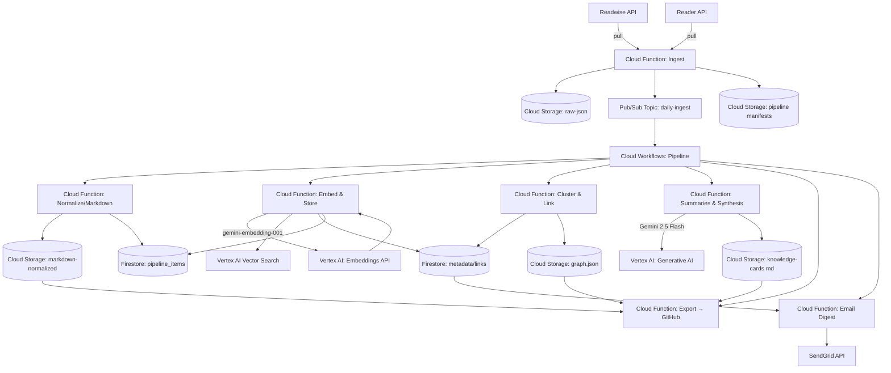
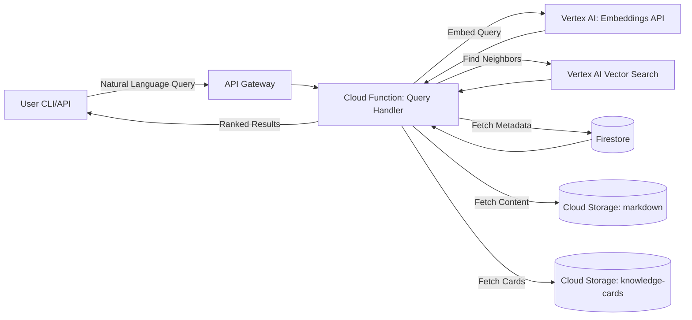

# System Architecture

## Batch Processing Pipeline (Daily)

The manifest bucket (`pipeline manifests`) captures each ingest run’s item IDs and timestamps, while the shared `pipeline_items` Firestore collection records `normalize_status`, `embedding_status`, hashes, and retry metadata so downstream stages can resume safely and avoid duplicate work.

## On-Demand Query Flow (User-Initiated)

---
